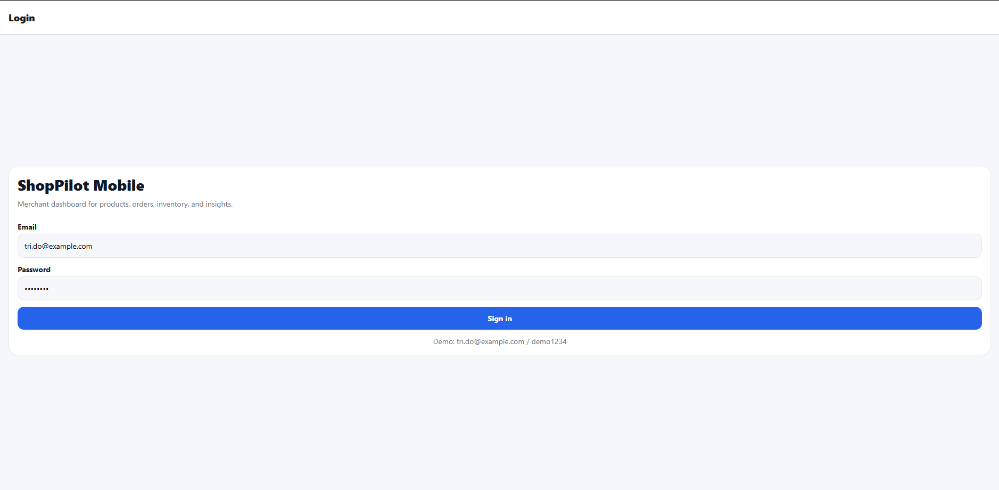
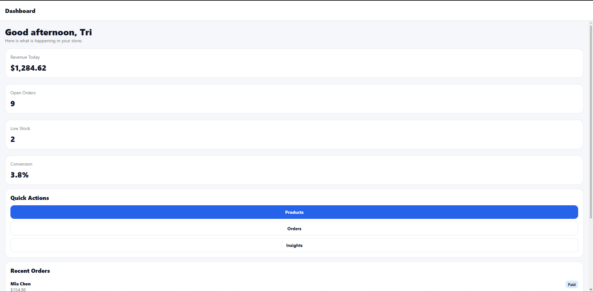
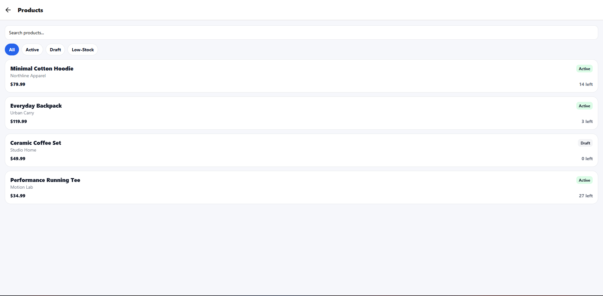
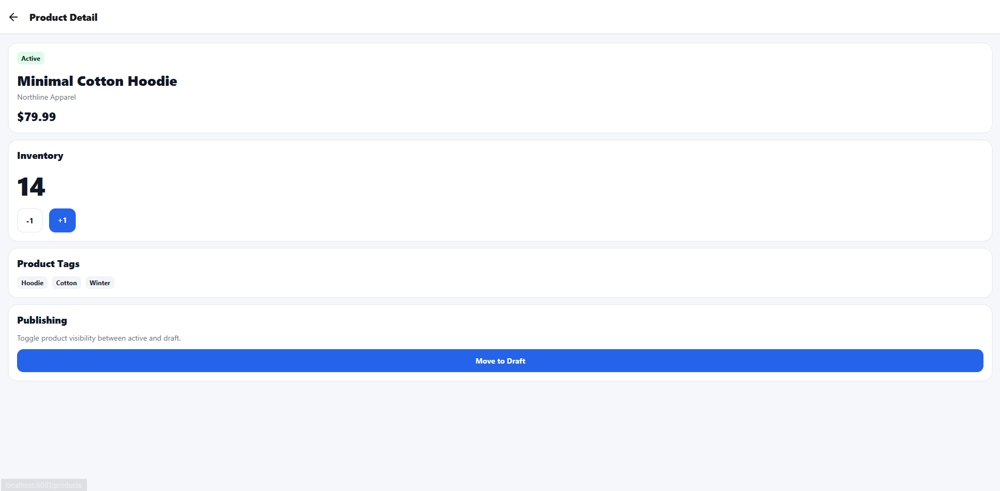
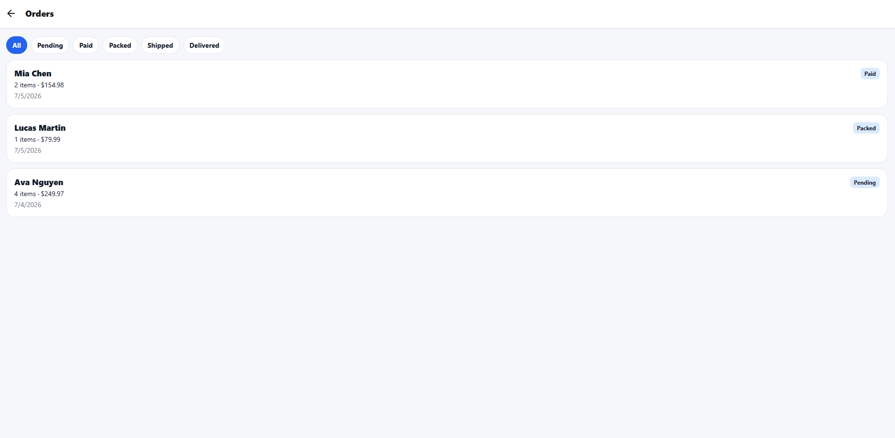
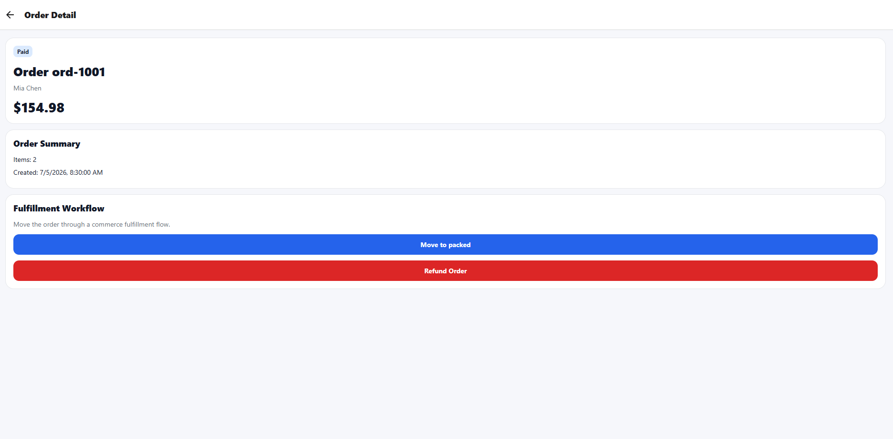
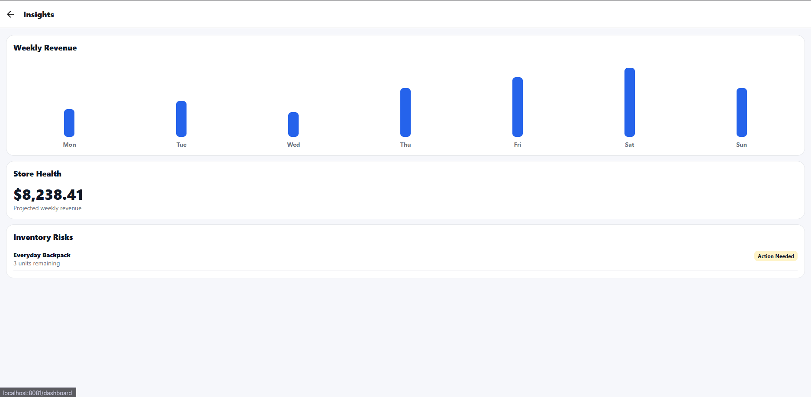

# ShopPilot Mobile

ShopPilot Mobile is a React Native merchant dashboard built with Expo, TypeScript, and Expo Router. The project is inspired by Shopify-style commerce workflows and focuses on product management, inventory tracking, order fulfillment, and store insights.

This project was built as a portfolio application to demonstrate React Native mobile development, TypeScript, reusable UI components, typed API services, mobile-first UI design, and commerce workflow development.

---

## Overview

ShopPilot Mobile helps store owners manage core commerce operations from a mobile dashboard.

The app includes:

- Demo login flow
- Merchant dashboard
- Product catalog management
- Product detail and inventory updates
- Order list and fulfillment workflow
- Order detail screen with status updates
- Revenue insights and inventory risk monitoring
- Reusable UI components
- Typed mock API service layer

---

## Tech Stack

- React Native
- Expo
- TypeScript
- Expo Router
- AsyncStorage
- React Hooks
- Mock API service layer
- Custom reusable UI components

---

## Features

### Authentication

- Demo login screen
- Persistent session storage using AsyncStorage
- Automatic redirect based on login state

Demo account:

```txt
Email: tri.do@example.com
Password: demo1234
```

---

### Merchant Dashboard

The dashboard provides a quick overview of store performance.

Included metrics:

- Revenue Today
- Open Orders
- Low Stock Products
- Conversion Rate

The dashboard also includes:

- Quick navigation actions
- Recent orders
- Low stock alerts

---

### Product Management

The product catalog allows merchants to:

- View all products
- Search products by name or vendor
- Filter products by status
- Filter low-stock products
- View product detail
- Update inventory
- Toggle product publishing status

Product statuses include:

- Active
- Draft
- Archived

---

### Order Management

The order module allows merchants to:

- View all orders
- Filter orders by fulfillment status
- Open order detail pages
- Move orders through a fulfillment workflow
- Refund orders

Order status workflow:

```txt
pending -> paid -> packed -> shipped -> delivered
```

---

### Insights

The insights screen shows store performance and risk indicators.

Included sections:

- Weekly revenue chart
- Projected weekly revenue
- Inventory risk alerts

---

## Screenshots

### Login



### Dashboard



### Products



### Product Detail



### Orders



### Order Detail



### Insights



---

## Project Structure

```txt
shoppilot-mobile/
│
├── app/
│   ├── _layout.tsx
│   ├── index.tsx
│   ├── login.tsx
│   ├── dashboard.tsx
│   ├── insights.tsx
│   │
│   ├── products/
│   │   ├── index.tsx
│   │   └── [id].tsx
│   │
│   └── orders/
│       ├── index.tsx
│       └── [id].tsx
│
├── src/
│   ├── api/
│   │   └── merchantApi.ts
│   │
│   ├── components/
│   │   ├── AppButton.tsx
│   │   ├── Card.tsx
│   │   ├── EmptyState.tsx
│   │   └── StatusPill.tsx
│   │
│   ├── constants/
│   │   └── theme.ts
│   │
│   ├── data/
│   │   └── mockData.ts
│   │
│   ├── types/
│   │   └── commerce.ts
│   │
│   └── utils/
│       ├── formatCurrency.ts
│       └── inventory.ts
│
├── screenshots/
├── package.json
├── tsconfig.json
└── README.md
```

---

## Architecture

The project separates screens, business logic, mock data, TypeScript types, and reusable UI components into clear folders.

### `app/`

Contains all Expo Router screens and navigation routes.

Main screens:

- `login.tsx`
- `dashboard.tsx`
- `products/index.tsx`
- `products/[id].tsx`
- `orders/index.tsx`
- `orders/[id].tsx`
- `insights.tsx`

### `src/api/`

Contains the typed mock API service layer. Screens do not access mock data directly. They call API functions such as:

- `getProducts()`
- `getProductById()`
- `updateProductInventory()`
- `getOrders()`
- `updateOrderStatus()`
- `getDashboardMetrics()`
- `getRevenuePoints()`

This structure makes the app easier to connect to a real backend later.

### `src/components/`

Contains reusable UI components used across multiple screens.

Examples:

- `AppButton`
- `Card`
- `EmptyState`
- `StatusPill`

### `src/types/`

Contains TypeScript domain models for products, orders, dashboard metrics, and revenue data.

### `src/utils/`

Contains helper functions for currency formatting, inventory checks, and order status transitions.

---

## Run Locally

Clone the repository:

```bash
git clone https://github.com/YOUR_USERNAME/shoppilot-mobile.git
```

Go into the project folder:

```bash
cd shoppilot-mobile
```

Install dependencies:

```bash
npm install
```

Start the Expo development server:

```bash
npm run start
```

Run TypeScript check:

```bash
npx tsc --noEmit
```

---

## Demo Login

Use this demo account to access the app:

```txt
Email: tri.do@example.com
Password: demo1234
```

---

## Key Technical Highlights

- Built a React Native mobile commerce dashboard with Expo and TypeScript
- Used Expo Router for file-based navigation
- Implemented typed commerce domain models for products, orders, metrics, and revenue data
- Created reusable UI components for cards, buttons, badges, and empty states
- Built a mock API service layer to simulate backend communication
- Added product search, product filtering, and inventory update functionality
- Added order filtering and fulfillment status transitions
- Added revenue insights and inventory risk monitoring
- Implemented loading, error, and empty UI states
- Used AsyncStorage for persistent demo authentication
- Designed the app around real merchant workflows

---

## Why This Project

This project was created to demonstrate skills relevant to React Native mobile engineering roles, especially commerce-focused applications.

It shows the ability to:

- Build mobile features with React Native
- Use TypeScript for safer application logic
- Structure a scalable front-end project
- Create reusable UI components
- Work with commerce workflows
- Separate UI logic from API and data logic
- Implement practical product and order management features
- Design user-focused merchant tools

---

## Resume Bullets

```txt
- Built a React Native commerce dashboard with Expo, TypeScript, and Expo Router for product, inventory, order, and revenue management.
- Implemented reusable mobile UI components, typed API services, persistent demo authentication, and merchant-focused workflows.
- Added product search/filtering, inventory updates, order status transitions, revenue insights, loading states, and error handling.
```

---

## Portfolio Description

ShopPilot Mobile is a React Native merchant dashboard inspired by Shopify-style commerce workflows. It allows store owners to monitor revenue, manage products, update inventory, process orders, and view store insights from a mobile-first interface.

The app uses Expo, TypeScript, Expo Router, reusable UI components, typed domain models, AsyncStorage authentication, and a mock API service layer.

---

## GitHub Topics

Recommended repository topics:

```txt
react-native
expo
typescript
expo-router
mobile-app
commerce
shopify
inventory-management
order-management
portfolio-project
```

---

## Future Improvements

Potential future enhancements:

- Connect to a real backend API
- Add real authentication
- Add product image upload
- Add push notifications for low stock
- Add dark mode
- Add unit tests
- Add offline support
- Add real chart library
- Add role-based merchant permissions
- Add Shopify API integration

---

## Author

Tri Do
