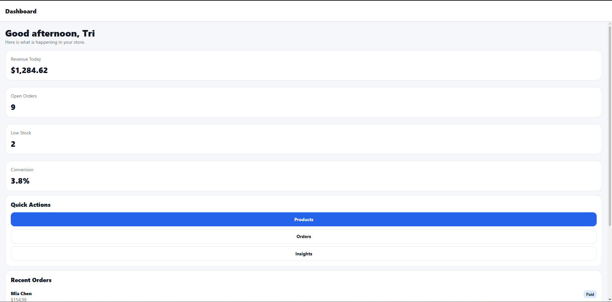
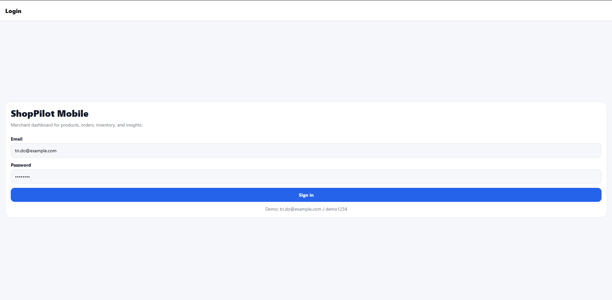
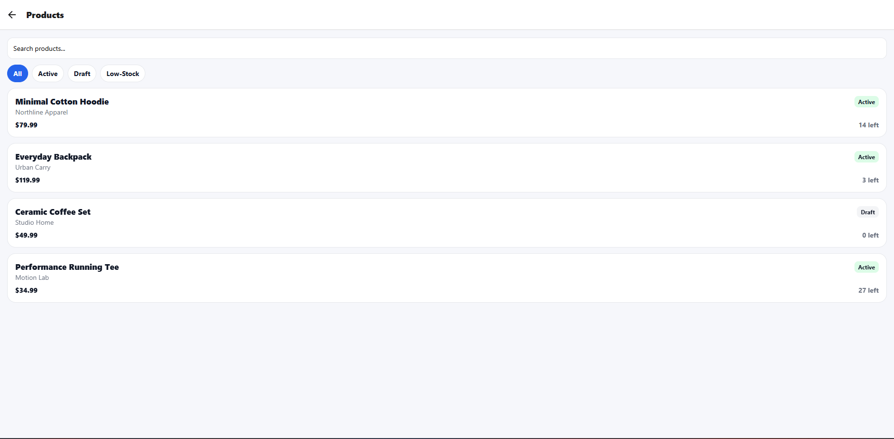
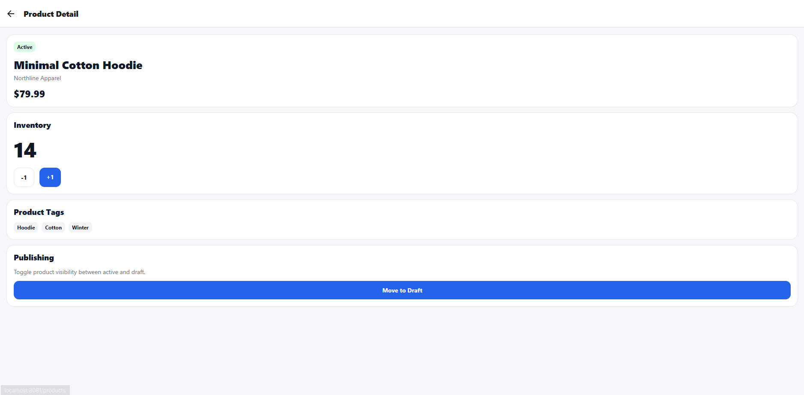
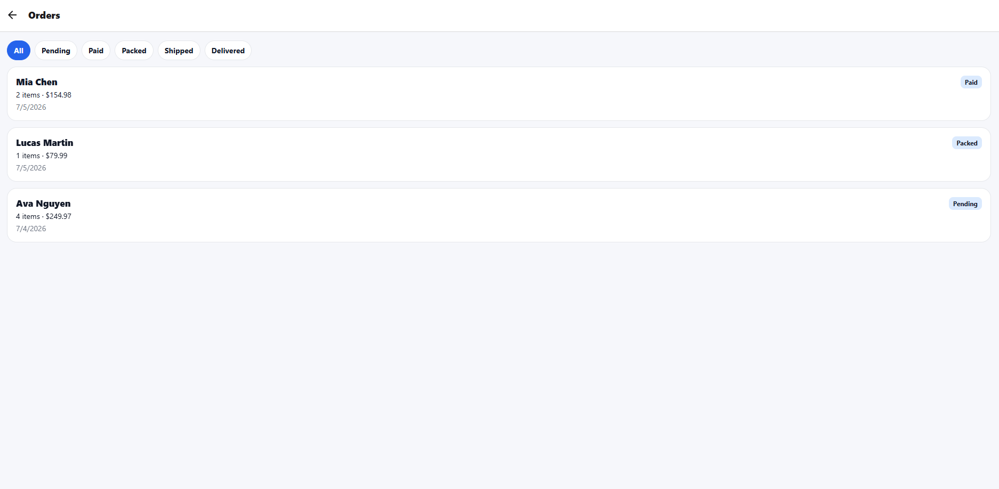
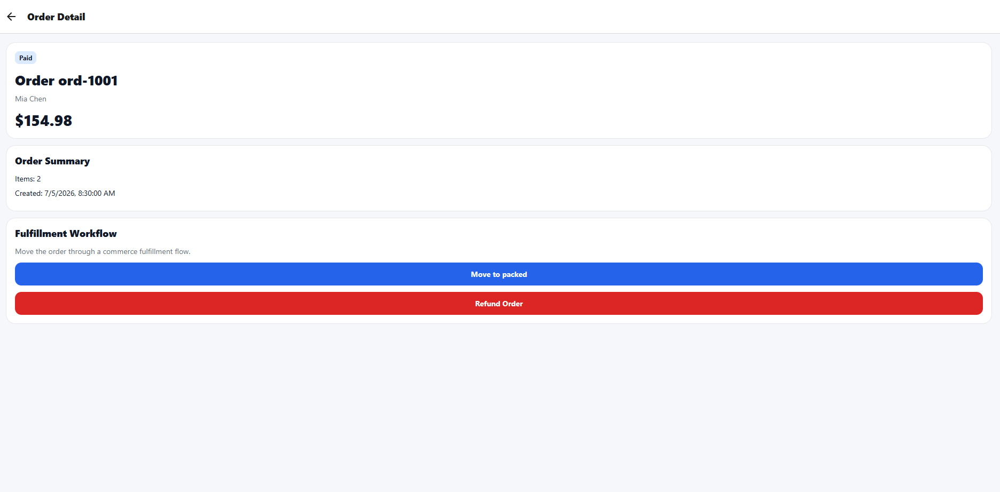
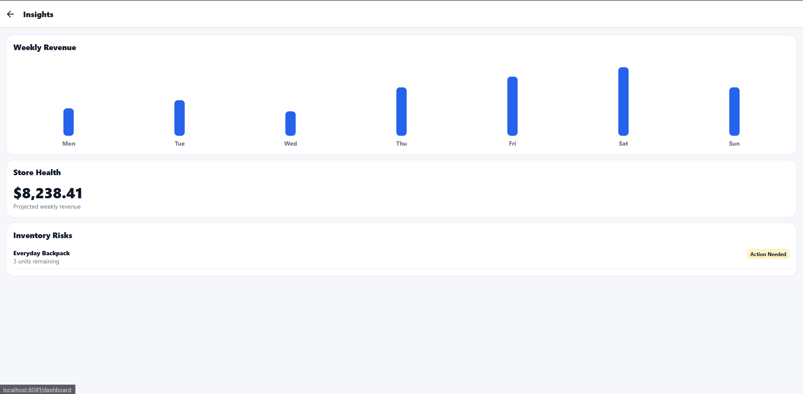

# ShopPilot Mobile

A cross-platform merchant operations dashboard built with **React Native**, **Expo**, **TypeScript**, **Expo Router**, and **Supabase**.

ShopPilot helps merchants manage products, inventory, orders, store settings, revenue, and storefront analytics from one responsive application. It was developed as a portfolio project to demonstrate production-style mobile architecture, authenticated data flows, row-level security, file storage, typed APIs, and commerce workflows.

<p align="center">
  
</p>

## Highlights

- Email/password authentication with session persistence
- Email confirmation and password recovery
- Protected routes for authenticated merchants
- Product CRUD with search, filters, inventory, tags, status, and image uploads
- Product image replacement and Storage cleanup
- Order and line-item management
- Fulfillment workflow and refunds
- Store profile, logo, business email, description, currency, and inventory threshold
- Revenue, traffic, conversion funnel, and top-product analytics
- Merchant isolation through Supabase Row Level Security
- Responsive layouts for web and mobile

## Tech Stack

| Area | Technology |
| --- | --- |
| Application | React Native, React 19, Expo 57 |
| Navigation | Expo Router |
| Language | TypeScript |
| Backend | Supabase Postgres and REST/RPC APIs |
| Authentication | Supabase Auth |
| File storage | Supabase Storage |
| Local persistence | AsyncStorage |
| Media | Expo Image, Expo Image Picker |
| Platforms | Android, iOS, Web |

## Core Features

### Authentication

- Register with email and password
- Confirm email before accessing merchant data
- Sign in and sign out
- Restore sessions after reload or app restart
- Request a password-reset email
- Update the password from a recovery link
- Redirect unauthenticated users away from protected routes

### Merchant Dashboard

The dashboard combines operational and performance data:

- Revenue today
- Open orders
- Low-stock products
- Seven-day conversion rate
- Recent orders
- Inventory alerts
- Store identity, logo, and business email
- Quick navigation to products, orders, insights, and settings

### Product Management

Merchants can:

- Create, edit, view, and delete products
- Upload, replace, and remove product images
- Search by title or vendor
- Filter by product status and inventory risk
- Manage price, tags, stock, and publishing status
- Use a merchant-configurable low-stock threshold

### Order Management

- View merchant-owned orders and line items
- Filter orders by status
- Open a detailed customer and item breakdown
- Move orders through the fulfillment workflow
- Refund orders with confirmation
- Reflect order changes in Dashboard and Insights

```text
pending -> paid -> packed -> shipped -> delivered
                     \-> refunded
```

### Store Settings

Each merchant can configure:

- Store name
- Business email
- Store description
- Store logo
- Currency
- Low-stock threshold

Currency and inventory settings are reused across Products, Orders, Dashboard, and Insights.

### Analytics

ShopPilot records and aggregates storefront events through Supabase RPC functions.

Tracked events include:

- Session started
- Product viewed
- Product added to cart
- Checkout started
- Checkout completed

Insights include:

- Seven-day revenue
- Store sessions
- Conversion funnel
- Daily traffic
- Product views and add-to-cart activity
- Top products
- Average order value
- Inventory risks

The merchant app includes sample analytics for demonstration. The tracking helper in `src/lib/storeAnalytics.ts` is ready to connect to a customer storefront.

## Screenshots

<table>
  <tr>
    <td align="center"><strong>Sign In</strong></td>
    <td align="center"><strong>Dashboard</strong></td>
  </tr>
  <tr>
    <td></td>
    <td></td>
  </tr>
  <tr>
    <td align="center"><strong>Products</strong></td>
    <td align="center"><strong>Product Detail</strong></td>
  </tr>
  <tr>
    <td></td>
    <td></td>
  </tr>
  <tr>
    <td align="center"><strong>Orders</strong></td>
    <td align="center"><strong>Order Detail</strong></td>
  </tr>
  <tr>
    <td></td>
    <td></td>
  </tr>
  <tr>
    <td align="center" colspan="2"><strong>Insights</strong></td>
  </tr>
  <tr>
    <td colspan="2"></td>
  </tr>
</table>

## Architecture

```text
src/
├── api/             # Typed Supabase data access and RPC calls
├── app/             # Expo Router screens and protected routes
│   ├── orders/
│   └── products/
├── components/      # Reusable UI components
├── constants/       # Theme tokens
├── contexts/        # Authentication and store settings state
├── lib/             # Supabase Auth, Storage, and analytics helpers
├── types/           # Commerce, authentication, and analytics models
└── utils/           # Formatting, inventory, and analytics utilities

supabase/
└── migrations/      # Database, RLS, Storage, settings, and analytics SQL
```

The application separates UI, session state, database access, storage operations, domain types, and business rules. Screens call typed API modules instead of accessing Supabase directly.

## Supabase Data Model

Main resources include:

- `profiles`
- `products`
- `orders`
- `order_items`
- `analytics_events`
- `product-images` Storage bucket
- `store-logos` Storage bucket

Every merchant-owned table uses Row Level Security. Product images and store logos are stored in user-specific folders and protected by Storage policies.

## Run Locally

### Prerequisites

- Node.js 20 or later
- npm
- Expo-compatible Android/iOS environment, or a modern browser
- A Supabase project

### Installation

```bash
git clone https://github.com/dominhtri055/shoppilot-mobile.git
cd shoppilot-mobile
npm install
```

Create a local environment file:

```bash
cp .env.example .env
```

On PowerShell:

```powershell
Copy-Item .env.example .env
```

Add your Supabase values:

```env
EXPO_PUBLIC_SUPABASE_URL=https://YOUR_PROJECT_REF.supabase.co
EXPO_PUBLIC_SUPABASE_PUBLISHABLE_KEY=YOUR_SUPABASE_PUBLISHABLE_KEY
```

Run every SQL file in `supabase/migrations/` in numeric order using the Supabase SQL Editor.

Start the project:

```bash
npm run start
```

Platform shortcuts:

```bash
npm run android
npm run ios
npm run web
```

## Validation

```bash
npx tsc --noEmit
npm run lint
```

Recommended manual QA:

1. Register and confirm a new account.
2. Test sign-in, session restoration, logout, and password recovery.
3. Create, edit, filter, and delete products with and without images.
4. Update order statuses and verify dashboard totals.
5. Change currency and inventory threshold in Store Settings.
6. Verify that a second merchant cannot access the first merchant's data or files.
7. Confirm Dashboard and Insights load the merchant's analytics report.

## Setup References

- `PRODUCTS_SETUP.md`
- `ORDERS_SETUP.md`
- `STORE_SETTINGS_SETUP.md`
- `ANALYTICS_SETUP.md`

## Portfolio Summary

ShopPilot Mobile demonstrates:

- Cross-platform React Native development
- File-based navigation with Expo Router
- Type-safe API and domain modeling
- Supabase authentication and password recovery
- PostgreSQL Row Level Security
- Secure Storage uploads and cleanup
- Product and order workflow design
- Server-side analytics aggregation with RPC functions
- Responsive, reusable UI architecture

## Current Scope

ShopPilot is a merchant management application. A future customer storefront can use the existing product data and `storeAnalytics` helper to add browsing, cart, checkout, and payment flows.

## Roadmap

- Automated unit and integration tests
- Push notifications for orders and low inventory
- Offline-aware caching and retry queues
- Role-based staff access
- Customer storefront and cart
- Payment-provider integration
- EAS production builds and store release assets

## Author

**Tri Do**

- GitHub: `dominhtri055`
- LinkedIn: `trido2908`
